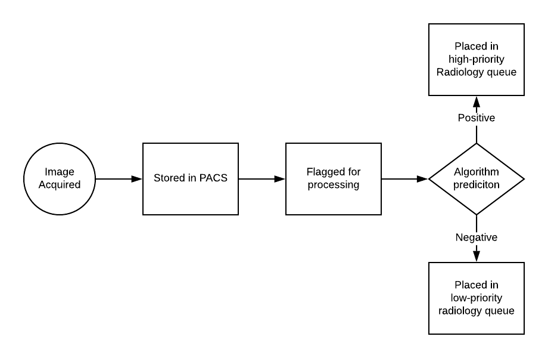
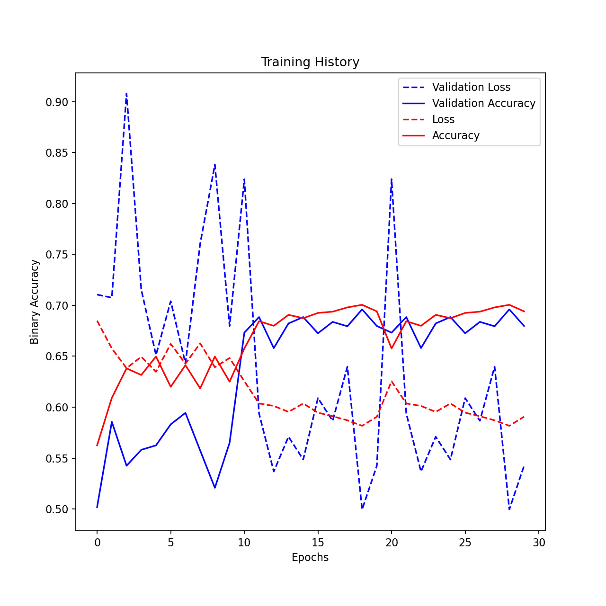
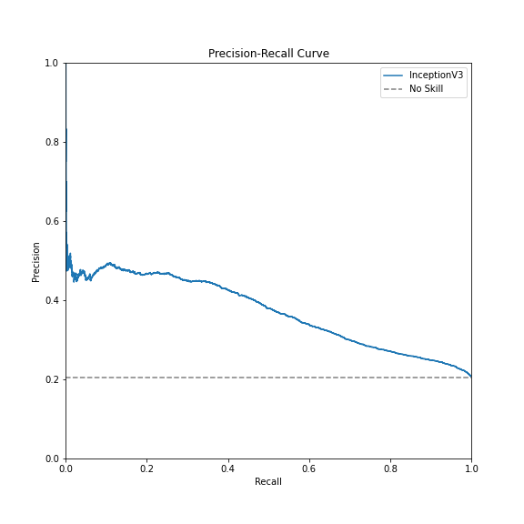

# FDA  Submission

**Your Name:** Ryan Case

**Name of your Device:** Chest X-Ray Consolidation Assisted Identification

## Algorithm Description 

### 1. General Information

**Intended Use Statement:** Assist Radiologist by re-ordering the priority queue.

**Indications for Use:** As a supplemental tool in a radiologist's workflow. Images are flagged negative with a high degree of precision (~95%). Intended for people with few known pre-exisiting conditions and under the age of 80. 

**Device Limitations:** AP and PA chest views only. Positives are not a guarantee of the presence of consolidation. All positives require additional follow-up.

**Clinical Impact of Performance:** Reduce radiologist workflow by accurately identifying negative cases. Improves radiologist efficiency by moving higher-risk scans to the front of the queue. 

### 2. Algorithm Design and Function

**DICOM Checking Steps:** Ensure that the image contains a chest image of the AP or PA view.

**Preprocessing Steps:** None

**CNN Architecture:** Uses the [Inception v3](https://cloud.google.com/tpu/docs/inception-v3-advanced) Convolutional Neural Network Architecture with a single, binary classification, output. 

### 3. Algorithm Training

**Parameters:**
* **Augmentation:** 
    - Image horizontal flip
    - 10% height and width shift
    - 20 degree rotation range
    - 30% zoom range
* **Batch size:** 32 samples per batch
* **Optimizer learning rate:** 1e-3 for 10 epochs lowering to 1e-4 thereafter
* **Layers Trainable:** All original layers are frozen for the first ten epochs, for the remaining time all layers are set as trainable at the lower learning rate of 1e-4.
* **Layers Modified:** Model matches the original architecture aside from the replacement of a 1,000 item softmax layer with a 1-item sigmoid layer to match the change to binary classification. 

**Final Threshold and Explanation:** Final threshold was set at 0.2. While this does generate a lot of false positives (roughly 3/4 of all positives) it gives the algorithm a 94.6% recall on the positive class, and a 93.9% precision on the negative class with 21.4% recall. In other words it identifies nearly all positive cases while still eliminating roughly 1/5 of the negative cases. As the negative class is roughly 4X the size of the positive class this is significant in terms of workload reduction.

### 4. Databases

**Description of Training Dataset:** The training set is 6,800 images of chest x-rays, equally divided between our positive and negative classes. The positive class is defined as an x-ray labeled with one or more of: "Pneumonia", "Consolidation", and/or "Infiltration." The negative class in the training set includes only images labeled "No Finding."

**Description of Validation Dataset:** The validation dataset is 16,568 images belonging to the positive class, the negative class, and the remaining images that were not classified as "No Finding" but also did not belong to our positive class. These were given proportions matching the original dataset, with the "No Finding" class being the largest and the "Positive" class making up roughly 21% of the cases. 

### 5. Ground Truth

The ground truth was established via radiologist labeling, extracted via NLP from a dataset of 112K chest x-rays.

### 6. FDA Validation Plan

**Patient Population Description for FDA Validation Dataset:** Patient population was under the age of 80 and had less than 4 conditions flagged by radiologists in their findings.

**Ground Truth Acquisition Methodology:** Radiologist labeling, extracted via NLP from the corresponding image reports.

**Algorithm Performance Standard:** ROC curve shows an AUC of 0.76 when considering only the testing set data (which does not include images of other conditions). Extending this to the validation set, which includes images from other diseases as well as different proportions of the classes, the AUC drops slightly to 0.70.

